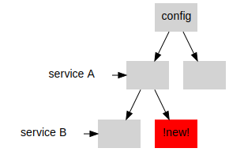
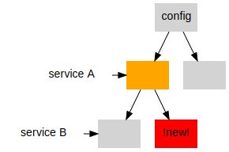
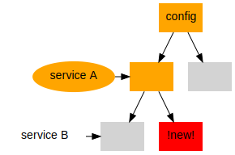
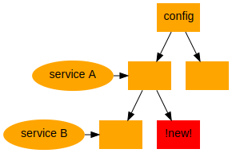
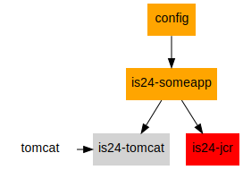
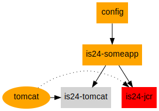

# Yadt | New Dependency Resolving

.fx: titleslide imageslide

---

# Old Strategy

.fx: imageslide

---

# Old Strategy

.fx: imageslide

---

# Old Strategy

.fx: imageslide

---

# Old Strategy

.fx: imageslide

---

.fx: imageslide

---

# New Strategy

.fx: imageslide

---

# New Strategy

.fx: imageslide

---

# New Strategy

.fx: imageslide

---

** Old vs. New **

.fx: imageslide

---

# Troublemaker: jcr

.fx: imageslide

---

# Solution

/etc/yadt.services

    !python
    ...
    tomcat:
        needs_artefacts: [is24-jcr]
    ...

---

# Solution

.fx: imageslide

---

# Question

What do we test in Tuv?

---

# Perspective

modularization of the yadt config

(an invitation to next yadt talk :o)

.fx: imageslide whiteheading

---

# Thanks!

2013-08-01 | IT-Pro-SD | Immobilienscout 24

.fx: titleslide imageslide
